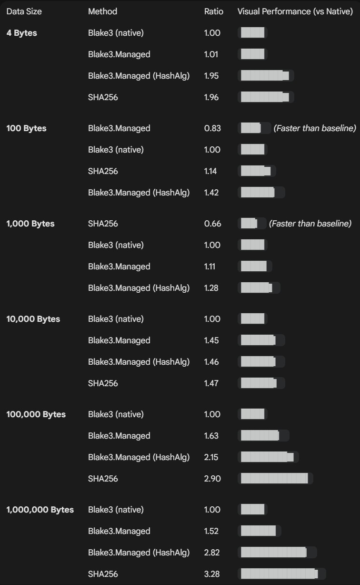

# Blake3.Managed

A pure managed C# implementation of the [BLAKE3](https://github.com/BLAKE3-team/BLAKE3) cryptographic hash function. Uses hardware intrinsics (AVX2, SSE4.1) for high performance with automatic scalar fallback. Zero native dependencies.

[](LICENSE)

## Features

- **Pure managed C#** - no native libraries, no P/Invoke, runs everywhere .NET runs
- **Hardware accelerated** - AVX2 8-way parallel hashing, SSE4.1 vectorized compression, automatic scalar fallback
- **Multi-threaded** - uses the thread pool for parallel chunk processing on large inputs (>64 KiB)
- **Zero allocation** for small inputs - one-shot `Hasher.Hash()` uses stack allocation
- **All BLAKE3 modes** - default hashing, keyed hashing, and key derivation
- **XOF support** - extendable output with seekable byte stream
- **API compatible** - similar API to the Blake3 Rust API and mirrors [Blake3.NET](https://github.com/xoofx/Blake3.NET) API surface
- **Targets** `net6.0` and `net8.0` (with hardware intrinsics)

## Blake3.NET

[Blake3.NET](https://github.com/xoofx/Blake3.NET) by Alexandre Mutel is the fastest and very polished BLAKE3 library for .NET I could find - it wraps the official Rust implementation via P/Invoke and is hard to beat on raw throughput. If native dependencies work for your project, it's an excellent choice.

This library exists for cases where a fully managed solution is preferred - easier deployment, no native binaries to ship, and support for platforms where the Rust library isn't available. My goal was to get as close to native performance as possible while staying pure C#. Some ideas and code examples are borrowed from Blake3.NET.

## Installation

```
dotnet add package Blake3.Managed
```

## Quick Start

```csharp
using Blake3.Managed;

// One-shot hash
var hash = Hasher.Hash("Hello, World!"u8);
Console.WriteLine(hash); // 288a86a79f20a3d6dccdca1c47c4c4726cddf1ae8c3ae5bdddf8f57a76a3a02e

// Incremental hashing
using var hasher = Hasher.New();
hasher.Update("Hello, "u8);
hasher.Update("World!"u8);
var result = hasher.Finalize();

// Keyed hash (32-byte key)
byte[] key = new byte[32]; // your key here
using var keyedHasher = Hasher.NewKeyed(key);
keyedHasher.Update(data);
var mac = keyedHasher.Finalize();

// Key derivation
using var kdf = Hasher.NewDeriveKey("my-session-key");
kdf.Update(inputKeyMaterial);
var derivedKey = kdf.Finalize();

// Extended output (XOF)
using var xof = Hasher.New();
xof.Update(data);
var extendedOutput = new byte[1024];
xof.Finalize(extendedOutput); // arbitrary length output

// Parallel hashing for large data
using var parallel = Hasher.New();
parallel.UpdateWithJoin(largeData); // uses thread pool for inputs >= 64 KiB
var parallelHash = parallel.Finalize();
```

## Public API

| Type | Description |
|------|-------------|
| `Hasher` | Main hasher struct. Factory methods: `New()`, `NewKeyed()`, `NewDeriveKey()`. Static `Hash()` for one-shot. Incremental via `Update()`/`UpdateWithJoin()`/`Finalize()`. |
| `Hash` | Fixed 32-byte output struct with constant-time equality and allocation-free `ToString()`. |
| `Blake3Stream` | Stream wrapper that hashes data as it flows through. |
| `Blake3HashAlgorithm` | `System.Security.Cryptography.HashAlgorithm` adapter for interop with existing APIs. |

## Performance

### Benchmarks

One-shot hashing (`Hasher.Hash(data)`) compared against [Blake3.NET](https://github.com/xoofx/Blake3.NET) (native Rust P/Invoke) and `System.Security.Cryptography.SHA256`:

```
BenchmarkDotNet v0.15.8, Windows 11 (10.0.26100.7921/24H2)
AMD Ryzen 7 PRO 7840U w/ Radeon 780M Graphics 3.30GHz, 1 CPU, 16 logical and 8 physical cores
.NET SDK 10.0.103
  [Host] : .NET 10.0.3 (10.0.326.7603), X64 RyuJIT x86-64-v4
```

| Method                     | Data Size |       Mean | Ratio |
|--------------------------- |----------:|-----------:|------:|
| **Blake3 (native)**        |     **4 B** |    **70.7 ns** |  **1.00** |
| Blake3.Managed             |       4 B |    75.5 ns |  1.07 |
| Blake3.Managed (HashAlgo)  |       4 B |   157.2 ns |  2.23 |
| SHA256                     |       4 B |   165.1 ns |  2.34 |
|                            |           |            |       |
| **Blake3 (native)**        |   **100 B** |   **123.2 ns** |  **1.00** |
| Blake3.Managed             |     100 B |   127.7 ns |  1.04 |
| Blake3.Managed (HashAlgo)  |     100 B |   196.0 ns |  1.59 |
| SHA256                     |     100 B |   186.8 ns |  1.52 |
|                            |           |            |       |
| **Blake3 (native)**        |  **1000 B** |   **822.4 ns** |  **1.00** |
| Blake3.Managed             |    1000 B |   913.4 ns |  1.11 |
| SHA256                     |    1000 B |   592.1 ns |  0.72 |
|                            |           |            |       |
| **Blake3 (native)**        | **10 KB** |   **2.90 us** |  **1.00** |
| Blake3.Managed             |   10 KB |   4.41 us |  1.52 |
| SHA256                     |   10 KB |   4.45 us |  1.53 |
|                            |           |            |       |
| **Blake3 (native)**        | **100 KB** |  **18.38 us** |  **1.00** |
| Blake3.Managed             |  100 KB |  24.86 us |  1.36 |
| SHA256                     |  100 KB |  45.37 us |  2.49 |
|                            |           |            |       |
| **Blake3 (native)**        |  **1 MB** | **143.7 us** |  **1.00** |
| Blake3.Managed             |    1 MB | 215.4 us |  1.50 |
| SHA256                     |    1 MB | 434.3 us |  3.03 |



- For **small inputs** (< 1 KB): Blake3.Managed is similar native Rust performance
- For **large inputs** (100 KB+): Blake3.Managed is ~1.5x slower than native

### Hardware Intrinsics Tiering

The implementation automatically selects the best available instruction set at runtime:

| Tier | Instructions | Parallelism |
|------|-------------|-------------|
| **AVX2** | 256-bit vectors + gather | 8 chunks simultaneously |
| **SSE4.1** | 128-bit vectors + shuffle | Single-lane SIMD |
| **Scalar** | Pure C# | Portable fallback |

## Building from Source

```bash
# Requires .NET 10 SDK
dotnet build src -c Release

# Run tests
dotnet test src/Blake3.Managed.Tests -c Release

# Run benchmarks
dotnet run --project src/Blake3.Managed.Benchmarks -c Release

# Create NuGet package
dotnet pack src/Blake3.Managed -c Release
```

## Security

This implementation passes all official BLAKE3 test vectors and uses constant-time hash comparison. See [SECURITY.md](SECURITY.md) for the security policy and responsible disclosure process.

**Note:** This library has not been independently audited. For security-critical applications requiring audited implementations, consider the native reference implementation.

## License

[MIT](LICENSE)

## Acknowledgments

- [Blake3.NET](https://github.com/xoofx/Blake3.NET) by Alexandre Mutel — API design and test infrastructure
- [Blake2Fast](https://github.com/saucecontrol/Blake2Fast) by Clinton Ingram — shuffle-based SSE message permutation
- [BLAKE3 Reference Implementation](https://github.com/BLAKE3-team/BLAKE3) — algorithm specification and test vectors
