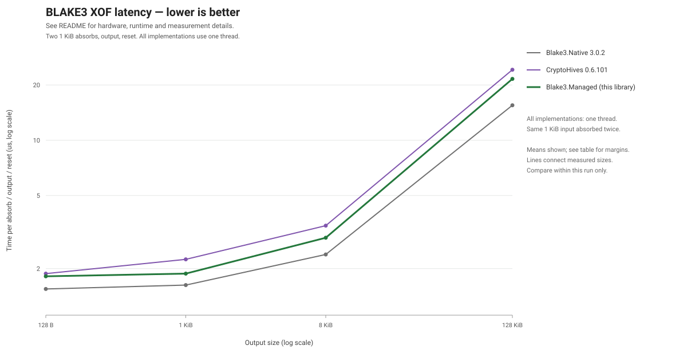

# Blake3.Managed: BLAKE3 hash function for .NET

A managed C# implementation of the [BLAKE3](https://github.com/BLAKE3-team/BLAKE3) hash function for .NET, with no native dependencies.

[](https://www.nuget.org/packages/Blake3.Managed)
[](https://www.nuget.org/packages/Blake3.Managed)
[](https://github.com/Dissimilis/Blake3.Managed/actions/workflows/ci.yml)
[](LICENSE)
[](https://buymeacoffee.com/dissimilis)

## Features

- **Hardware accelerated** - AVX2 8-way parallel hashing, SSE/SSSE3 vectorized compression, ARM NEON 4-way parallel hashing, automatic scalar fallback
- **Multi-threaded** - one-shot `Hash()`, `Blake3HashAlgorithm` and `Blake3Stream` split large inputs into subtrees and hash them on the thread pool above ~72 KiB
- **Split hashing** - hash pieces independently and combine them into the whole-input digest with `Blake3SubtreeContext`
- **Zero allocation** for small inputs with `Hasher.Hash()`
- **All BLAKE3 modes** - default hashing, keyed hashing, and key derivation
- **XOF support** - extendable output with a seekable byte stream and AVX2 batching for long output
- **Familiar API** - modeled after [Blake3.NET](https://github.com/xoofx/Blake3.NET)
- **Targets** `net6.0`, `net8.0` and `net10.0`, with Native AOT support

## Other BLAKE3 packages

[Blake3.NET](https://github.com/xoofx/Blake3.NET) by Alexandre Mutel provides two packages in version 3.x: `Blake3`, a managed SIMD implementation, and `Blake3.Native`, a binding to the Rust implementation.

Blake3.Managed also supports .NET 6 and uses multiple cores for large one-shot hashes. Set `Hasher.MaxDegreeOfParallelism` to limit its thread usage when your application already processes multiple inputs in parallel.

The [benchmarks below](#performance) compare these packages, CryptoHives and SHA256, with separate results for one-shot hashing and extended output.

## Installation

```bash
dotnet add package Blake3.Managed
```

## Quick Start

```csharp
using Blake3.Managed;

// One-shot hash
var hash = Hasher.Hash("Hello, World!"u8);
Console.WriteLine(hash); // 288a86a79f20a3d6dccdca7713beaed178798296bdfa7913fa2a62d9727bf8f8

// Incremental hashing
using var hasher = Hasher.New();
hasher.Update("Hello, "u8);
hasher.Update("World!"u8);
var result = hasher.Finalize();
```

## Usage examples

### Keyed hashing and key derivation

```csharp
// Keyed hash (32-byte key)
byte[] key = new byte[32]; // your key here
using var keyedHasher = Hasher.NewKeyed(key);
keyedHasher.Update(data);
var mac = keyedHasher.Finalize();

// Key derivation
using var kdf = Hasher.NewDeriveKey("my-session-key");
kdf.Update(inputKeyMaterial);
var derivedKey = kdf.Finalize();
```

### Extended output

```csharp
using var xof = Hasher.New();
xof.Update(data);
var extendedOutput = new byte[1024];
xof.Finalize(extendedOutput); // arbitrary length output
```

### Parallel hashing

```csharp
using var parallel = Hasher.New();
parallel.UpdateWithJoin(largeData); // uses thread pool above ~72 KiB
var parallelHash = parallel.Finalize();
```

For one-shot `Hasher.Hash`, the thread limit is process-wide and does not affect `UpdateWithJoin`:

```csharp
Hasher.MaxDegreeOfParallelism = 4;  // use at most 4 threads
Hasher.MaxDegreeOfParallelism = 1;  // run on the calling thread
Hasher.MaxDegreeOfParallelism = -1; // restore the default
```

### Hashing independent pieces

`Blake3SubtreeContext` combines independently hashed pieces into the whole-input digest. `ReadPiece` below represents your own file-reading code.

```csharp
using var ctx = Blake3SubtreeContext.Create(pieceSize: 1024 * 1024, totalLength: file.Length);
var pieces = new Blake3Subtree[ctx.PieceCount];
Parallel.For(0, ctx.PieceCount, i =>
{
    var piece = ReadPiece(file, ctx.GetPieceOffset(i), ctx.GetPieceLength(i));
    pieces[i] = ctx.HashSubtree(piece, i);
});
var fileHash = ctx.Finalize(pieces); // equals Hasher.Hash(wholeFile)
```

A piece can also be fed incrementally, without keeping it all in memory. This supports pieces larger than 2 GB:

```csharp
using var pieceHasher = ctx.CreateSubtreeHasher(pieceIndex);
while ((n = await stream.ReadAsync(buffer)) > 0)
    pieceHasher.Update(buffer.AsSpan(0, n));
pieces[pieceIndex] = pieceHasher.Finish();
```

## Public API

| Type | Description |
|------|-------------|
| `Hasher` | Main hasher struct. Factory methods: `New()`, `NewKeyed()`, `NewDeriveKey()`. Static `Hash()` for one-shot. Incremental via `Update()`/`UpdateWithJoin()`/`Finalize()`. Static `MaxDegreeOfParallelism` caps the fan-out used by `Hash()`. |
| `Hash` | Fixed 32-byte output struct with constant-time equality and allocation-free `ToString()`. |
| `Blake3Stream` | Stream wrapper that hashes data as it flows through. |
| `Blake3HashAlgorithm` | `System.Security.Cryptography.HashAlgorithm` adapter for interop with existing APIs. |
| `Blake3SubtreeContext` | Hashes fixed-size pieces of one input independently, on any threads and in any order, and folds them into the whole-input digest (32 bytes or XOF). Piece size must be a power-of-two multiple of 1024, unless the known total length fits in a single piece, in which case any size works; it is a `long`, so pieces larger than 2 GB are allowed. |
| `Blake3SubtreeHasher` | Hashes one piece incrementally through `Update` calls and `Finish`, for pieces that arrive in parts or are too large for one span. Created by `Blake3SubtreeContext.CreateSubtreeHasher`. |
| `Blake3Subtree` | Opaque result of hashing one piece, stored at its piece index and passed to `Finalize`. |

## Performance

### Benchmark environment

Measured on **2026-09-09**, with the optimizations included in `v1.5.2`.

```text
BenchmarkDotNet 0.15.8, Windows 11 (10.0.26200.9168)
AMD Ryzen 7 PRO 7840U, 8 physical cores / 16 logical threads
.NET SDK 10.0.303, .NET 10.0.11, X64 RyuJIT with AVX-512 available
Report job: 1 launch, 3 warmup iterations, 5 measured iterations
```

Tables show **mean time ± the 99.9% confidence margin**, with lower times being
better. Each table and chart comes from the same run for that workload. Cases
run sequentially, so clock and thermal changes can affect comparisons; a lower
mean with overlapping intervals is inconclusive. Every session first passed
7,492 correctness checks against official vectors and the Rust implementation.

### One-shot hashing

All BLAKE3 implementations write into a caller-provided 32-byte destination.
This library uses `Hasher.Hash(input, output)`. CryptoHives uses a reused
instance's `TryHashOneShot` with its default SIMD selection; the package reports
SSSE3, AVX2 and AVX-512 support on this machine. SHA256 is a different algorithm,
provided as a reference.

Above **72 KiB**, this library uses multiple cores; the other columns use one
thread. Large-input results therefore compare latency with different core
counts. KiB and MiB denote powers of 1,024; the chart's GB/s is decimal.

| Input | Blake3.Native 3.0.2 | Blake3 3.0.2 (xoofx) | CryptoHives 0.6.101 | Blake3.Managed (this library) | SHA256 (.NET) |
|---:|---:|---:|---:|---:|---:|
| 4 B | 98.09 ± 2.18 ns | 101.35 ± 1.06 ns | 109.17 ± 3.30 ns | 71.08 ± 5.79 ns | 224.44 ± 37.28 ns |
| 128 B | 171.71 ± 2.21 ns | 161.20 ± 4.18 ns | 182.26 ± 6.02 ns | 148.19 ± 2.90 ns | 308.04 ± 27.07 ns |
| 1 KiB | 1.21 ± 0.01 us | 1.32 ± 0.01 us | 1.35 ± 0.04 us | 1.24 ± 0.01 us | 0.87 ± 0.03 us |
| 2 KiB | 1.27 ± 0.02 us | 2.78 ± 0.08 us | 2.12 ± 0.15 us | 1.23 ± 0.01 us | 1.55 ± 0.03 us |
| 4 KiB | 1.74 ± 0.02 us | 5.61 ± 0.02 us | 2.29 ± 0.09 us | 2.03 ± 0.03 us | 2.84 ± 0.06 us |
| 6 KiB | 3.03 ± 0.07 us | 8.32 ± 0.07 us | 2.41 ± 0.07 us | 2.09 ± 0.02 us | 4.02 ± 0.04 us |
| 8 KiB | 1.84 ± 0.01 us | 2.30 ± 0.02 us | 2.45 ± 0.04 us | 2.15 ± 0.01 us | 5.28 ± 0.02 us |
| 16 KiB | 3.09 ± 0.03 us | 3.80 ± 0.03 us | 4.65 ± 0.02 us | 4.06 ± 0.14 us | 10.41 ± 0.02 us |
| 64 KiB | 11.89 ± 0.04 us | 14.64 ± 0.12 us | 17.51 ± 0.16 us | 15.45 ± 0.13 us | 41.14 ± 0.33 us |
| 128 KiB | 23.44 ± 0.33 us | 29.11 ± 0.19 us | 38.12 ± 1.30 us | 11.12 ± 0.55 us | 82.75 ± 0.79 us |
| 1 MiB | 199.79 ± 4.74 us | 289.81 ± 12.93 us | 309.28 ± 10.26 us | 44.42 ± 3.81 us | 663.53 ± 1.91 us |
| 10 MiB | 2.78 ± 0.13 ms | 4.15 ± 0.32 ms | 4.54 ± 0.75 ms | 0.44 ± 0.02 ms | 6.82 ± 0.13 ms |


In this run, the 2 KiB and 6 KiB rows beat all three BLAKE3 competitors. Native
remains faster at several other single-threaded sizes.

### Extended output (XOF)

Each operation absorbs the **same 1 KiB block twice**, emits the indicated
output length, then resets a reused hasher. All three implementations use one
thread. The chart measures the complete operation: absorption, output and reset.

| Output | Blake3.Native 3.0.2 | CryptoHives 0.6.101 | Blake3.Managed (this library) |
|---:|---:|---:|---:|
| 128 B | 2.57 ± 0.06 us | 2.98 ± 0.03 us | 3.02 ± 0.08 us |
| 1 KiB | 3.46 ± 0.04 us | 3.50 ± 0.03 us | 3.09 ± 0.04 us |
| 8 KiB | 10.62 ± 0.13 us | 5.53 ± 0.02 us | 4.62 ± 0.05 us |
| 128 KiB | 134.36 ± 1.15 us | 38.03 ± 0.30 us | 33.73 ± 0.08 us |



The batched output path leads this comparison at 1 KiB, 8 KiB and 128 KiB of
output; native leads at 128 bytes. The XOF numbers are from a separate matched
run on the same machine.

### Reproducing the results

```bash
# One-shot table: 5 implementations, 12 input sizes
dotnet run --project src/Blake3.Managed.Benchmarks -c Release -- --competitive --report --filter '*Native*' '*Xoofx*' '*CryptoHives*' '*OursSpan*' '*Sha256*'

# XOF table: 3 implementations, 4 output sizes
dotnet run --project src/Blake3.Managed.Benchmarks -c Release -- --xof --report --filter '*AfterXof*' '*NativeXof*' '*CryptoHivesXof*'

# Regenerate the charts from a BenchmarkDotNet CSV export (Python, no dependencies)
python src/Blake3.Managed.Benchmarks/make_chart.py <oneshot-report.csv> img/benchmark.svg --context "<CPU> · <.NET version> · <date>"
python src/Blake3.Managed.Benchmarks/make_chart.py <xof-report.csv> img/benchmark-xof.svg --xof --context "<CPU> · <.NET version> · <date>"
```

The generator also accepts a BenchmarkDotNet console log. Use `--table table.md`
and `--data results.csv` to produce matching Markdown and chart data from a new
run.

### Hardware Intrinsics Tiering

The implementation automatically selects the best available instruction set at runtime:

| Tier | Instructions | Parallelism |
|------|-------------|-------------|
| **AVX2** | 256-bit vectors; AVX-512 VL rotates when available | 8-chunk batches, partial batches for 5–7 chunks, 2-chunk remainders, 8-way parent hashing and 8-block XOF output |
| **SSE/SSSE3** | 128-bit vectors + shuffle | 4 chunks simultaneously, single-lane SIMD fallback |
| **ARM NEON** | 128-bit vectors | 4 chunks simultaneously |
| **Scalar** | Pure C# | Portable fallback |

## Building from Source

```bash
# Requires .NET 10 SDK
dotnet build Blake3.Managed.sln -c Release

# Run tests
dotnet test src/Blake3.Managed.Tests -c Release

# Run benchmarks
dotnet run --project src/Blake3.Managed.Benchmarks -c Release

# Create NuGet package
dotnet pack src/Blake3.Managed -c Release
```

## Acknowledgments

- [Blake3.NET](https://github.com/xoofx/Blake3.NET) by Alexandre Mutel, for API design and test infrastructure
- [Blake2Fast](https://github.com/saucecontrol/Blake2Fast) by Clinton Ingram, for the shuffle-based SSE message permutation
- [BLAKE3 Reference Implementation](https://github.com/BLAKE3-team/BLAKE3), for the algorithm specification and test vectors
