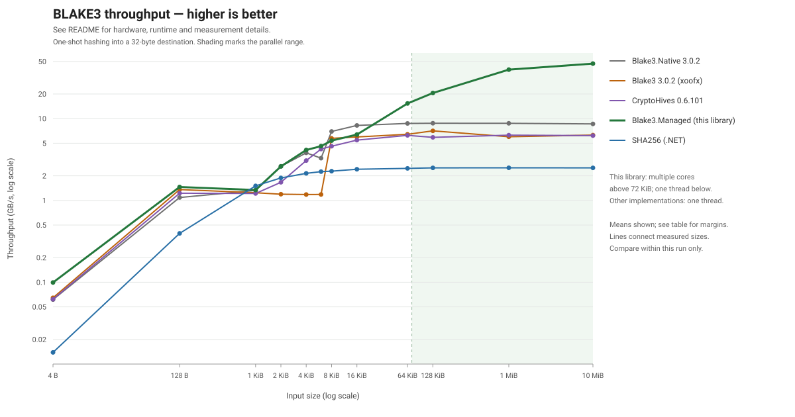

# Blake3.Managed: BLAKE3 hash function for .NET

A pure managed C# implementation of the [BLAKE3](https://github.com/BLAKE3-team/BLAKE3) cryptographic hash function for .NET. Uses hardware intrinsics (AVX2, SSE/SSSE3, ARM NEON) for high performance with automatic scalar fallback. Faster than SHA-256 and MD5, with zero native dependencies and no P/Invoke.

BLAKE3 is a modern, secure hash ideal for file checksums, content addressing, deduplication, data integrity, message authentication (keyed MAC) and key derivation (KDF). This library brings it to C# / .NET as a single fully managed, Native AOT-friendly NuGet package that runs everywhere .NET runs.

[](https://www.nuget.org/packages/Blake3.Managed)
[](https://www.nuget.org/packages/Blake3.Managed)
[](https://github.com/Dissimilis/Blake3.Managed/actions/workflows/ci.yml)
[](LICENSE)
[](https://buymeacoffee.com/dissimilis)

## Features

- **Pure managed C#** - no native libraries, no P/Invoke, runs everywhere .NET runs
- **Hardware accelerated** - AVX2 8-way parallel hashing, SSE/SSSE3 vectorized compression, ARM NEON 4-way parallel hashing, automatic scalar fallback
- **Multi-threaded** - one-shot `Hash()`, `Blake3HashAlgorithm` and `Blake3Stream` hash 64-chunk subtrees on the thread pool for inputs above ~72 KiB
- **Split hashing** - hash pieces of one file or download on different threads, machines, or at different times, then combine the pieces into the same hash you would get from hashing the whole thing at once (`Blake3SubtreeContext`)
- **Zero allocation** for small inputs - one-shot `Hasher.Hash()` uses stack allocation
- **All BLAKE3 modes** - default hashing, keyed hashing, and key derivation
- **XOF support** - extendable output with seekable byte stream
- **API compatible** - similar API to the Blake3 Rust API and mirrors [Blake3.NET](https://github.com/xoofx/Blake3.NET) API surface
- **Targets** `net6.0`, `net8.0` and `net10.0` (with hardware intrinsics)

## How this compares to the other BLAKE3 packages

[Blake3.NET](https://github.com/xoofx/Blake3.NET) by Alexandre Mutel is a very polished BLAKE3 library for .NET, and some ideas and code examples here are borrowed from it. As of 3.x it ships as two packages: `Blake3` is now a pure managed SIMD implementation, and `Blake3.Native` is the P/Invoke binding to the official Rust code. Both are excellent.

So "managed versus native" is no longer the interesting distinction - there are several good managed options. What this library offers instead:

- **A multithreaded one-shot path.** `Hasher.Hash` splits large inputs into balanced subtrees and hashes them on the thread pool, so above roughly 72 KB it finishes sooner than any single-threaded implementation, including the Rust binding. That is wall-clock latency bought with more cores, not better per-core efficiency, which is worth knowing if you are already saturating every core with other work.
- **`net6.0` support**, which `Blake3` 3.x dropped.
- **No native dependency**, so deployment stays simple and Native AOT and trimming work without extra care.

On short inputs it is the fastest of the three: 4 bytes and 128 bytes both beat the Rust binding and `Blake3` 3.x outright. Between 1 KB and 64 KB, where the work is single-threaded, it runs at 1.0x to 1.8x the Rust implementation depending on size. See the numbers below.

## Installation

```
dotnet add package Blake3.Managed
```

## Quick Start

```csharp
using Blake3.Managed;

// One-shot hash
var hash = Hasher.Hash("Hello, World!"u8);
Console.WriteLine(hash); // 288a86a79f20a3d6dccdca1c47c4c4726cddf1ae8c3ae5bdddf8f57a76a3a02e

// Incremental hashing
using var hasher = Hasher.New();
hasher.Update("Hello, "u8);
hasher.Update("World!"u8);
var result = hasher.Finalize();

// Keyed hash (32-byte key)
byte[] key = new byte[32]; // your key here
using var keyedHasher = Hasher.NewKeyed(key);
keyedHasher.Update(data);
var mac = keyedHasher.Finalize();

// Key derivation
using var kdf = Hasher.NewDeriveKey("my-session-key");
kdf.Update(inputKeyMaterial);
var derivedKey = kdf.Finalize();

// Extended output (XOF)
using var xof = Hasher.New();
xof.Update(data);
var extendedOutput = new byte[1024];
xof.Finalize(extendedOutput); // arbitrary length output

// Parallel hashing for large data
using var parallel = Hasher.New();
parallel.UpdateWithJoin(largeData); // uses thread pool above ~72 KiB
var parallelHash = parallel.Finalize();

// Capping how many threads the one-shot Hasher.Hash may use
// (process-wide; does not affect UpdateWithJoin, and never changes the digest)
Hasher.MaxDegreeOfParallelism = 4;  // at most 4 threads
Hasher.MaxDegreeOfParallelism = 1;  // caller's thread only; use when you are
                                    // already parallelising over many inputs
Hasher.MaxDegreeOfParallelism = -1; // default: let the thread pool decide

// Hashing pieces of one input on your own threads, in any order, and folding
// them into the digest a whole-input hash would produce
using var ctx = Blake3SubtreeContext.Create(pieceSize: 1024 * 1024, totalLength: file.Length);
var pieces = new Blake3Subtree[ctx.PieceCount];
Parallel.For(0, ctx.PieceCount, i =>
{
    var piece = ReadPiece(file, ctx.GetPieceOffset(i), ctx.GetPieceLength(i));
    pieces[i] = ctx.HashSubtree(piece, i);
});
var fileHash = ctx.Finalize(pieces); // equals Hasher.Hash(wholeFile)
```

## Public API

| Type | Description |
|------|-------------|
| `Hasher` | Main hasher struct. Factory methods: `New()`, `NewKeyed()`, `NewDeriveKey()`. Static `Hash()` for one-shot. Incremental via `Update()`/`UpdateWithJoin()`/`Finalize()`. Static `MaxDegreeOfParallelism` caps the fan-out used by `Hash()`. |
| `Hash` | Fixed 32-byte output struct with constant-time equality and allocation-free `ToString()`. |
| `Blake3Stream` | Stream wrapper that hashes data as it flows through. |
| `Blake3HashAlgorithm` | `System.Security.Cryptography.HashAlgorithm` adapter for interop with existing APIs. |
| `Blake3SubtreeContext` | Hashes fixed-size pieces of one input independently, on any threads and in any order, and folds them into the whole-input digest (32 bytes or XOF). Piece size must be a power-of-two multiple of 1024. |
| `Blake3Subtree` | Opaque result of hashing one piece, stored at its piece index and passed to `Finalize`. |

## Performance

### Benchmarks

One-shot hashing (`Hasher.Hash(data)`) against the Rust implementation via P/Invoke
([Blake3.Native](https://www.nuget.org/packages/Blake3.Native)), the managed
[Blake3](https://www.nuget.org/packages/Blake3) 3.x package, and `System.Security.Cryptography.SHA256`.
Above roughly 72 KB, `Hasher.Hash` spreads the work across cores; every other column is single-threaded.

```
BenchmarkDotNet v0.15.8, Windows 11 (10.0.26200)
AMD Ryzen 7 PRO 7840U w/ Radeon 780M Graphics, 1 CPU, 16 logical and 8 physical cores
.NET SDK 10.0.303, .NET 10.0.11, X64 RyuJIT AVX-512
```

Mean time per hash, and the ratio against the Rust implementation (lower is better):

| Input | Blake3.Native (Rust) | Blake3 3.x (managed) | **Blake3.Managed** | SHA256 |
|------:|---------------------:|---------------------:|-------------------:|-------:|
| 4 B | 78.5 ns | 78.4 ns _(1.00)_ | **51.9 ns _(0.66)_** | 148.6 ns _(1.89)_ |
| 128 B | 128.7 ns | 117.7 ns _(0.91)_ | **111.6 ns _(0.87)_** | 202.7 ns _(1.57)_ |
| 1 KB | 855.6 ns | 935.8 ns _(1.09)_ | **868.5 ns _(1.02)_** | 595.4 ns _(0.70)_ |
| 4 KB | 1.21 us | 3.90 us _(3.22)_ | **1.44 us _(1.18)_** | 1.94 us _(1.60)_ |
| 8 KB | 1.38 us | 1.81 us _(1.32)_ | **1.74 us _(1.27)_** | 3.78 us _(2.75)_ |
| 16 KB | 2.31 us | 3.29 us _(1.42)_ | **3.22 us _(1.39)_** | 7.46 us _(3.23)_ |
| 64 KB | 8.87 us | 11.35 us _(1.28)_ | **12.54 us _(1.41)_** | 29.16 us _(3.29)_ |
| 128 KB | 16.89 us | 23.51 us _(1.39)_ | **8.24 us _(0.49)_** | 57.81 us _(3.42)_ |
| 1 MB | 141.2 us | 260.5 us _(1.84)_ | **45.2 us _(0.32)_** | 518.5 us _(3.67)_ |
| 10 MB | 2.78 ms | 3.91 ms _(1.40)_ | **0.50 ms _(0.18)_** | 5.66 ms _(2.03)_ |



### Hardware Intrinsics Tiering

The implementation automatically selects the best available instruction set at runtime:

| Tier | Instructions | Parallelism |
|------|-------------|-------------|
| **AVX2** | 256-bit vectors | 8 chunks simultaneously, plus 8-way parent-node hashing for the merge tree |
| **SSE/SSSE3** | 128-bit vectors + shuffle | 4 chunks simultaneously, single-lane SIMD fallback |
| **ARM NEON** | 128-bit vectors | 4 chunks simultaneously |
| **Scalar** | Pure C# | Portable fallback |

## Building from Source

```bash
# Requires .NET 10 SDK
dotnet build src -c Release

# Run tests
dotnet test src/Blake3.Managed.Tests -c Release

# Run benchmarks
dotnet run --project src/Blake3.Managed.Benchmarks -c Release

# Create NuGet package
dotnet pack src/Blake3.Managed -c Release
```

## Acknowledgments

- [Blake3.NET](https://github.com/xoofx/Blake3.NET) by Alexandre Mutel, for API design and test infrastructure
- [Blake2Fast](https://github.com/saucecontrol/Blake2Fast) by Clinton Ingram, for the shuffle-based SSE message permutation
- [BLAKE3 Reference Implementation](https://github.com/BLAKE3-team/BLAKE3), for the algorithm specification and test vectors
